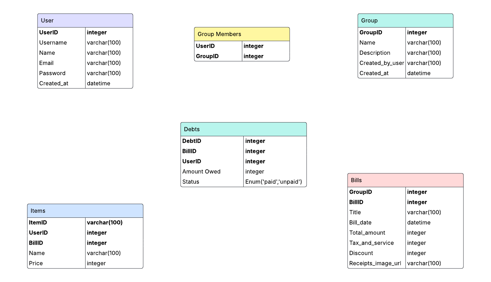

# DiBagi - Aplikasi Split Bill


**DiBagi** adalah aplikasi mobile _cross-platform_ (Android & iOS) yang dirancang untuk memudahkan pembagian tagihan secara adil, cepat, dan transparan. Lupakan kerumitan menghitung manual dan rasa tidak nyaman saat menagih teman!

## 📱 Unduh Aplikasi (On Progress)

Tujuan akhir proyek ini adalah menyediakan aplikasi yang siap pakai. Nantinya, kamu bisa mengunduh file `.apk` (Android) atau rilis lainnya langsung dari tab **[Releases](https://github.com/FRWLabs/DiBagi/releases)** di halaman GitHub ini.

**Status Saat Ini:** ⚠️ Aplikasi masih dalam tahap pengembangan aktif dan belum tersedia untuk diunduh.

---

## 👩‍💻 Ingin Berkontribusi?

Kami sangat terbuka untuk kontribusi! Jika kamu tertarik membantu mengembangkan DiBagi, berikut adalah panduannya.

### Tumpukan Teknologi (Tech Stack)

- **Frontend:** Flutter
- **Backend:** NestJS, TypeScript
- **Database:** MySQL, Supabase

### Panduan Instalasi

Proyek ini terdiri dari dua bagian: **frontend** (aplikasi Flutter) dan **backend** (API NestJS). Kamu perlu menjalankan keduanya secara terpisah.

#### 1. Backend (NestJS API)

```sh
# Clone repository
git clone https://github.com/FRW-Labs/DiBagi.git
cd server

# Install dependency
npm install

# Jalankan server backend
npm run start:dev
```

#### 2\. Frontend (Flutter App)

```sh
# Masuk ke folder frontend
cd client

# Install dependency
flutter pub get

# Jalankan aplikasi di emulator atau device
flutter run
```

### Skema Database (ERD)


